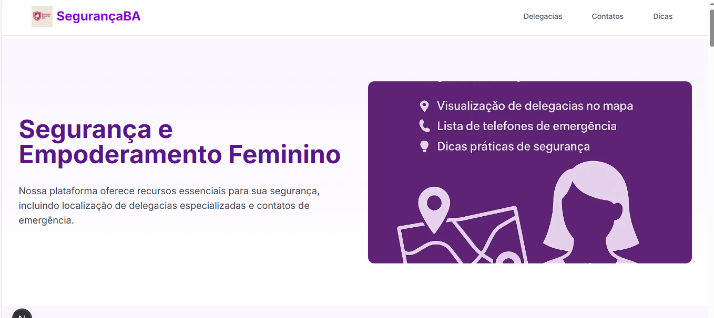

# 💜 Segurança Feminina

> Uma plataforma web desenvolvida para promover o bem-estar e a segurança de mulheres, oferecendo acesso fácil a informações, recursos e serviços de emergência.

---

## 📌 Contextualização

O **Segurança Feminina** é um projeto criado com o propósito de auxiliar mulheres em situações de risco, fornecendo acesso rápido a:

- Delegacias especializadas próximas, com visualização no mapa;
- Contatos úteis de emergência (como Polícia Militar, Central de Atendimento à Mulher - 180, etc.);
- Dicas práticas de segurança pessoal;
- Interface amigável e acessível via dispositivos móveis e desktops.

Este projeto busca fomentar a **autonomia, proteção e cidadania digital** feminina, utilizando tecnologia como ferramenta de transformação social.

---

## 🛠️ Tecnologias Utilizadas

| Tecnologia            | Versão       |
|----------------------|--------------|
| React.js             | 18.x         |
| TypeScript           | 5.x          |
| Vite                 | 5.x          |
| Tailwind CSS         | 3.x          |
| Leaflet.js (Mapas)   | 1.9.x        |
| Axios                | 1.x          |
| Node.js (para API)   | 20.x         |
| API Segurança Mulher | Versão 1.0   |

---

## 🚀 Como Executar o Projeto

Siga os passos abaixo para rodar o projeto localmente:

### 1. Clone o repositório
```bash
git clone https://github.com/seu-usuario/seguranca-feminina.git
cd seguranca-feminina
```

### 2. Instale as dependências
```bash
npm install
```

### 3. Inicie o servidor de desenvolvimento
```bash
npm run dev
```

Acesse: `http://localhost:5173` no navegador.

> Obs.: Certifique-se de que a API esteja ativa e configurada corretamente. Você pode configurar a URL base da API no arquivo `.env`.

---

## 🔗 API Utilizada

Este projeto consome os dados da [API Segurança Feminina](https://github.com/seu-usuario/api-seguranca-feminina), que fornece informações sobre delegacias, contatos de emergência e conteúdos educativos.

---

## 🖼️ Imagens do Projeto

### 🧭 Página principal:


### 🗺️ Mapa com delegacias:


### 📄 Dicas de segurança:


> *As imagens estão localizadas na pasta `public/images` e devem ser atualizadas conforme o projeto.*

---

## 📍 About (Sobre)

- 🌐 **Site hospedado:** [https://segurancafeminina.vercel.app]([https://segurancafeminina.vercel.app](https://seguran-a-da-mulher.onrender.com/))
- 💼 **Apresentação no LinkedIn:** [Veja a publicação aqui](https://www.linkedin.com/posts/seu-usuario_seguran%C3%A7a-tecnologia-mulher-activity-XXXXXXXXXXXXXXX)

---

## 🏷️ Tópicos (Tags do Repositório)

- `#webapp`
- `#seguranca-feminina`
- `#reactjs`

---

## 🙋‍♀️ Contribuição

Contribuições são muito bem-vindas! Sinta-se à vontade para abrir uma issue ou pull request. 💜

---

## 📄 Licença

Este projeto está licenciado sob a Licença MIT.

---

